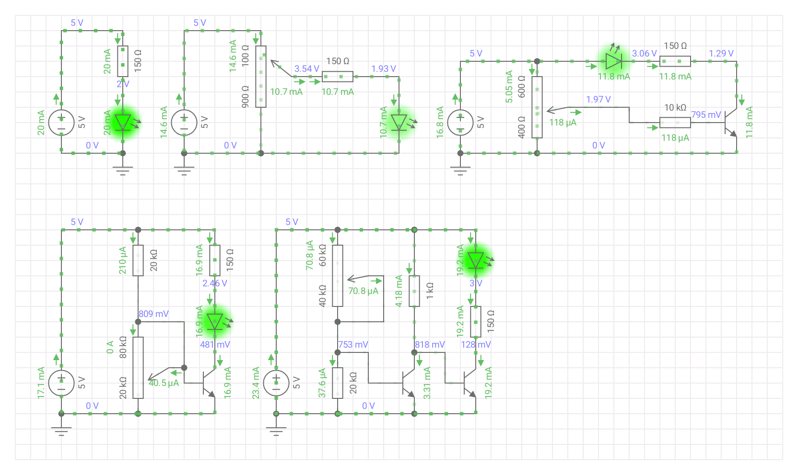

# 光控灯

此文件夹提供了整个光控灯示例分解电路以供参考。

---

可以根据在仿真软件中实验电路或在实际中用面包板、万能板搭接或焊接出来测试。

如有安装Proteus7，可打开[Proteus-电位器调节LED示例电路](./Proteus/Proteus7_电位器调节LED示例仿真电路.DSN)查看简单示例。

---

## 电路

### LED+限流电阻

LED串联电阻并点亮LED的电路

* LED（发光二极管）
* 电阻、LED电路中的限流电阻的作用及简单计算

### 电位器调LED亮度

电位器分压而调节LED亮度的电路

* 电位器结构和原理
* 分压电路

### 电位器+三极管调LED亮度

电位器分压驱动三极管点亮并调节LED亮度的电路

* 认识三极管
	* 三极管是一种用小电流控制大电流的元件。
* 了解三极管的简单应用

### ...
